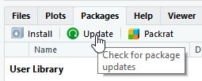
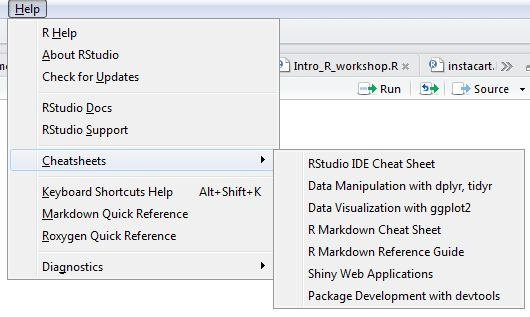

```{r set-options, echo=FALSE, cache=FALSE}
options(width = 50)
```


## Topics

We will touch on the following:

- getting data into `R`
- data wrangling
- data visualization
- combining, merging and reshaping
- some programming
- reporting

I'm assuming you're brand new to `R`. 


## A little about `R`

- A statistical computing environment with its own language
- Released in 2000; an open source implementation of S
- Maintained by volunteers
- https://www.r-project.org/


## RStudio

- I recommend you use `R` with the free RStudio IDE (Interactive Development Environment).

- RStudio makes it easier to learn and use `R`.

- It does things like auto-complete, syntax highlighting, and much more.

- **After you install `R` and RStudio, you only need to run RStudio.**


## `R` basics - functions

* `R` uses *functions* to do things.

* Functions take *arguments* to specify how, or to what, to do those things. Example:

    + `read.csv(file="scores.csv")` 

* `read.csv` is a function to import a CSV file; `file` is an argument that specifies which file to import.


## `R` basics - running functions

Two common ways to run functions:

1. From the command line; type the function and hit Enter
2. In an `R` script; type one or more functions, and run one or more of them by highlighting and hitting Ctrl + Enter (Win/Linux) or Command + Enter (Mac)

An `R` script is a text file that contains all your `R` code. `R` scripts allow you to save, edit, reproduce and share your code.   
\ 

Today's class will be centered around `R` scripts I wrote in advance.


## `R` basics - assignment

* We often need to save a function's result or output. For this we use the assignment operator: ` <- `  

* For example, when you import a CSV file you need to give it a name: 

`scores <- read.csv(file="scores.csv")`   
 
* Now we can use `scores` as an argument to other functions. For example, compute summary statistics for each column in the data:

`summary(scores)` 

* **Note**: Use `Alt + -` (Win/Linux) or `Option + -` (Mac) in RStudio to quickly insert ` <- `. Can also use `=` for assignment, but it's techincally different than `<-`. See `?assignOps`


## `R` basics - packages

- All functions belong to *packages*. The `read.csv` function is in the `utils` package.

- `R` comes with about 30 packages (called "Base `R`"), but there are over 10,000 user-contributed packages.

- Example: `ggplot2` is a popular package that adds functions for creating graphs in a different way than what base `R` provides

- To use functions in a package, the package must be installed and loaded. (They're free)

- You only _install_ a package once. 

- You _load_ a package whenever you want to use its functions. 

## Installing and updating packages

- To install a package, say ggplot2: `install.packages("ggplot2")`

- To see what packages have new versions available: `old.packages()`

- To update all packages: `update.packages(ask = FALSE)`

- These can also be done through RStudio's GUI.




## Comments on updating packages, R and RStudio

- There is rarely a reason to not upgrade to newer versions of R. It is very stable and usually includes performance improvements and obscure bug fixes. 

- There is rarely a reason to not upgrade to newer versions of RStudio. Help...Check for Updates. It will also notify you when an update is available.

- You may want to think twice about upgrading packages, especially if have working code and an approaching deadline. Package developers are sometimes less concerned about stability and legacy code.

- Compare "Installed" to "ReposVer" after running `old.packages()`. A version that jumps from, say, 1.1 to 2.0 may introduce changes that can break your code.


## Base `R` versus the tidyverse

- There is currently a series of packages gaining popularity within the R community called the "tidyverse".

- They essentially replace much of the data wrangling and plotting you do with Base `R`.

- See _R for Data Science_ to learn the philosophy: http://r4ds.had.co.nz/

- I emphasize the tidyverse but also show the Base `R` equivalent.

- Base `R` has some quirks but is very stable. 

- The tidyverse can make your life easier but is under active development. Code that works today may not work a few months from now.


## Get your cheatsheets




## Data: gapminder.csv

A small excerpt from the Gapminder data, http://www.gapminder.org/, extracted and cleaned up by https://github.com/jennybc/gapminder

- `country`: name of country
- `continent`: continent of country
- `year`: year of measurement, from 1952 to 2007 in 5-year increments
- `lifeExp`: life expectancy
- `pop`: population size
- `gdpPercap`: GDP per capita

## Data: collegeCompletion.xlsx

Data for 3,800 degree-granting institutions (collegecompletion.chronicle.com). A few key variables:

- `chronname`: Institution name
- `level`: Level of institution (4-year, 2-year)
- `control`: Public, Private non-profit, Private profit
- `grad_100_value`: Percentage of undergraduates who complete a program within 100 percent of expected time
- `grad_150_value`: Percentage of undergraduates who complete a program within 150 percent of expected time
- `student_count`: Total number of undergraduates in 2010
- `med_sat_value`: Median est. SAT value for incoming students
- `aid_value`: The average amount of student aid going to undergraduate recipients
- `endow_value`: End-of-year endowment value per full-time student
- `pell_value`: Percent of undergrads receiving Pell Grant

## Data: stock prices (7 csv files)

Historical prices from seven stocks (downloaded from Google finance)

- `Date`: day of trading
- `Open`: opening price
- `High`: highest asking price 
- `Low`: lowest asking price 
- `Close`: closing price
- `Volume`: number of shares traded


## Data: Instacart Orders (5 csv files)

The Instacart Online Grocery Shopping Dataset 2017:
https://www.instacart.com/datasets/grocery-shopping-2017; 5 datasets

- `orders_train.csv`: one row per order
- `order_products_train.csv`: one row per product per order
- `products.csv`: one row per product with product, aisle and dept ids
- `aisles.csv`: key to aisles
- `departments.csv`: key to departments


## Invest in some books

- Grolemund, G & Wickham, H. *R for Data Science*, O'Reilly, 2017. http://r4ds.had.co.nz/ 

- Grolemund, G. *Hands-On Programming with R*, O'Reilly, 2014.

- Wickham, H. *Advanced R*, Chapman & Hall, 2014. http://adv-r.had.co.nz/

- Lander, J., *R for Everyone*, Addison-Wesley, 2014.

- Kabacoff, R., *R in Action*, Manning, 2015.

- Zumel, N. & Mount, J. *Practical Data Science with R*, Manning, 2014.


## Web sites and social media

- Sign up for the R-Bloggers daily email: http://www.r-bloggers.com/

- Join the UVa `R` Users Group: http://www.meetup.com/UVa-R-Users-Group/

- Stats 337: Readings in Applied Data Science: https://github.com/hadley/stats337

- Follow on Twitter: @rstudio, @hadleywickham, @JennyBryan